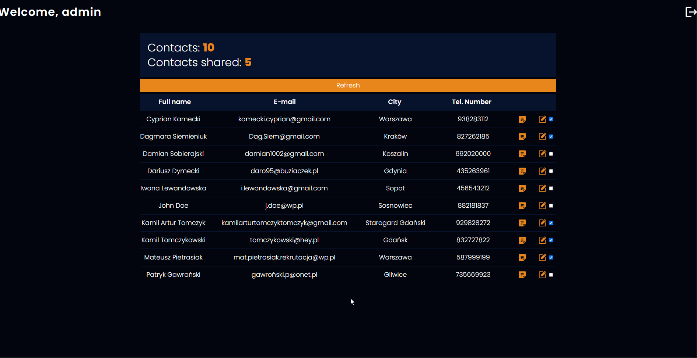

<p align="center">
  
</p>

# Headhunting Center - Javascript project
The Headhunting Center is a project I found on the devmentor.pl website. It was supposed to meet certain conditions that were to determine whether I am ready to start applying for junior positions.

# [Live DEMO](https://headhunting-center.vercel.app/)


<br>
<br>

## Tech stack
The application was developed using the following tools:
- Javascript,
- React,
- Redux,
- React Query,
- TailwindCSS
<br>
  
## Getting Started

Follow these steps to install Headhunting center on your local environment.
<br>
<strong>Clone projects repository</strong>
```
git clone https://github.com/KamilTomczykDev/headhunting-center.git
```
<strong>Install the packages</strong>
```
npm install
```

<strong>Run the app using terminal</strong>
```
npm run dev
```
<br>

# Requirements

## General:
- Build a responsive web app within 40 hours.
- Use best practices to provide good performance, scalability and readability of the project.

## Features:
- Allow user to add new contact
- Implement a way to login as a admin and guest
- Allow Admin to add and edit notes about each contact
- Create a way to share selected contacts with the guest account.
- Allow guest to see the limited version of admins dashboard.

# Implementation

## Redux
Despite Redux being a clear case of 'overengineering' for a project of this size, I decided to use this technology to showcase my general proficiency with it.

# Contact

## [LinkedIn](https://www.linkedin.com/in/kamil-tomczyk-a118952b3/)
I'm currently active on this platform. Feel free to ask any questions about my projects or anything else :)
